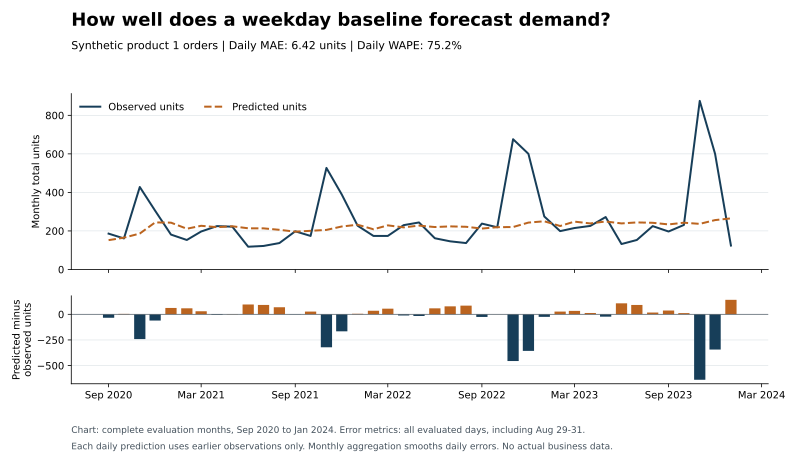

# Synthetic Demand Forecasting

A weekday demand baseline inspired by e-commerce inventory planning. All input records are synthetic and contain no production business data. The dataset covers 42 calendar months, from August 2020 through January 2024.

## Method

The script models product 1. After a 28-day warm-up, it predicts each day using the average for that weekday across earlier dates. Days without orders count as zero. Each prediction is evaluated before that day's demand enters the training history.

The script reports mean absolute error and weighted absolute percentage error from those rolling predictions. It sums expected demand across the supplier's 21-day lead time and compares it with a 600-unit threshold. This check does not use actual inventory positions and cannot establish that a stockout was predicted three weeks early.

The included data produced MAE of 6.42 units and WAPE of 75.2% in the October 2026 evaluation. This is a weak baseline on synthetic data, not a validated production forecast.



## Run

```bash
python scripts/demand_forecast.py
python -m unittest discover -s tests -v
```

Run from the repository root. Only the Python standard library is required. The generated `q4_demand_forecast_with_alerts.csv` contains daily observations and predictions, alongside the lead-time total and a reorder-threshold flag. Despite its legacy filename, it covers the evaluation period beyond Q4.

## Files

- `scripts/demand_forecast.py`: rolling-origin evaluation and CSV export.
- `scripts/data_pipeline.sql`: sample PostgreSQL aggregation of demand and inventory.
- Root CSV files: synthetic input records.
- `dashboards/demand_backtest.svg`: observed and predicted totals for complete evaluation months.

To rebuild the chart, install `matplotlib` and run `python scripts/plot_evaluation.py`. The forecast itself needs no third-party packages.

The model has no seasonal component or validated Q4-specific warning claim. Error on synthetic records does not demonstrate accuracy for a real business.
